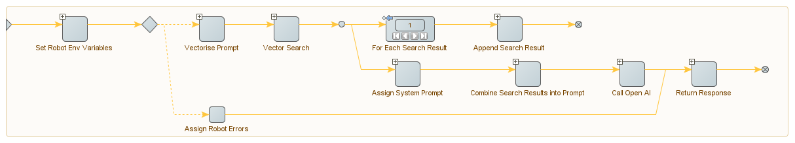

### RAG_Example_Automation
This automation bot illustrates how to implement a Retrieval Augmented Generation pattern by orchrestrating different web service calls.

 - Vectorise the prompt
 - Performs a vector search to retrieve the most relevant content chunks
 - Combines the results returned by the search results into a single text block separated by `###ARTICLE_START###` and `###ARTICLE_STOP###`
 - Maps the combined search results to a "system" prompt, adds an additional "system" prompt providing guidance to OpenAI on how to use the searc results
 - Calls the "Chat Completions" API with the "user" prompt and various "system" prompts

Example "system" prompt for the use of the search results:

```
Use the only the information in the provided articles, delimited by ###ARTICLE_START### AND ###ARTICLE_STOP###, to answer the question or respond to the prompt. Keep to the token limit in all responses, do not truncate sentences. If relevant content cannot be found in the articles provided, do not attempt to answer using general knowledge, instead reply "The question is outside of the scope of this ChatBot's training - I was unable to find a suitable answer."
```

The RAG Automation uses the following steps:


**Note** to be sure to escape / json escape any text data passed as prompts.

**Note** depending on the speed of the search index and the chat completions deployment, this task can take some time to complete, typically 15-20seconds, but it could be 30-60seconds for complex prompts with large volumes of data. If your RPA environment is deployed behind a proxy/gateway service like Azure Front Door be sure to increase the timeout to suitable level to account for these delays.

